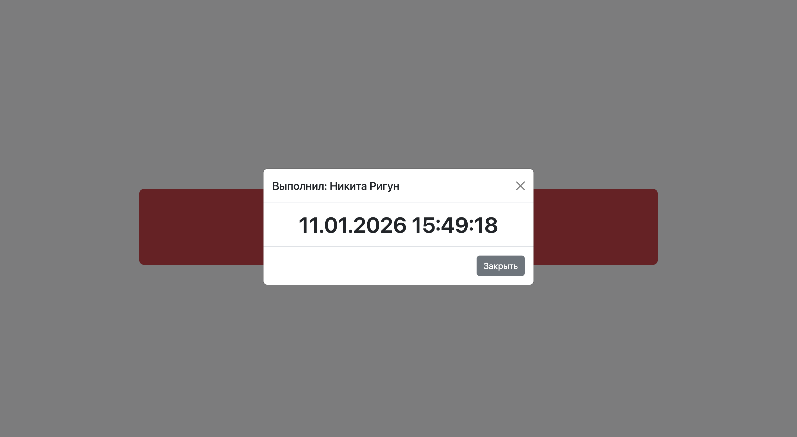

# Luxon + Bootstrap + Vite

## Описание проекта

В этом проекте я собрал простое клиентское веб-приложение с помощью сборщика **Vite**.  
Библиотеки **Bootstrap** и **Luxon** подключены через npm, а не через CDN, поэтому вся страница собирается и работает как единое приложение.

На странице находится большая кнопка «Показать время». При нажатии на неё открывается модальное окно, в котором отображается текущая дата и время. Для работы с датой и временем используется библиотека Luxon, а внешний вид страницы и модальное окно реализованы с помощью Bootstrap.

Проект выполнен в рамках практики по сборке фронтенд-приложений и работе со сторонними библиотеками через сборщик.

---

## Как это реализовано

Страница сделана по аналогии с предыдущим этапом задания. Используется сетка Bootstrap из трёх колонок (2–8–2), где в центральной колонке расположена большая красная кнопка.

При клике на кнопку:
- берётся текущее время с помощью Luxon;
- открывается модальное окно Bootstrap;
- в модальном окне отображается отформатированная дата и время.

Чтобы уменьшить размер итогового бандла, из JavaScript Bootstrap используется только компонент модального окна, а не вся библиотека целиком.

---

## Скриншот интерфейса

Ниже показан внешний вид страницы с открытым модальным окном:



---

## Сборка проекта

Для сборки проекта используется команда:

```bash
npm run build
Команда указана в файле package.json и запускает production-сборку с помощью Vite.

Размер бандла
После сборки проекта получены следующие файлы:

JavaScript: ~92 KB

CSS: ~225 KB

Файлы находятся в папке dist/assets.

Ссылки
Репозиторий с исходниками:
https://github.com/nikitusuik/luxon-vite-bootstrap

Опубликованная версия проекта:
https://nikitusuik.github.io/luxon-vite-bootstrap/


